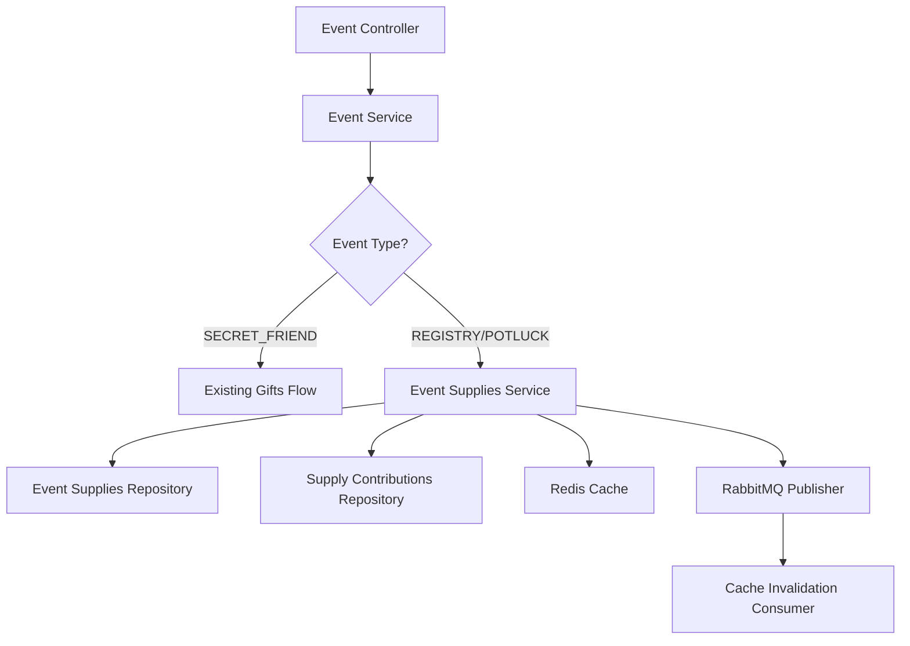
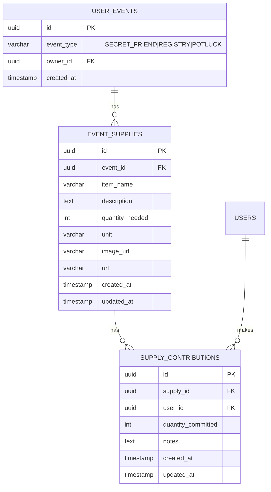

# Design Document: Registry and Potluck Events

## Overview

This design extends the Gift 4U event system to support two new event types: REGISTRY (for weddings and baby showers) and POTLUCK (for BBQs and collaborative events). The core architectural change inverts the existing gift list logic: instead of users maintaining personal wishlists, the event owner defines needed items, and participants commit to providing them.

The design follows NestJS module patterns with TypeORM entities, implements a cache-aside strategy using Redis, and uses RabbitMQ for asynchronous cache invalidation. The implementation will coexist with the existing SECRET_FRIEND event flow without disruption.

## Architecture

### High-Level Design



### Module Organization

The feature will be implemented within the existing `events` module with new sub-components:

- **EventSuppliesController**: HTTP endpoints for supply management
- **EventSuppliesService**: Business logic for supplies and contributions
- **EventSupply Entity**: TypeORM entity for event_supplies table
- **SupplyContribution Entity**: TypeORM entity for supply_contributions table
- **DTOs**: Request/response validation objects

### Database Schema



## Components and Interfaces

### EventSupply Entity

```typescript
@Entity('event_supplies')
export class EventSupply {
  @PrimaryGeneratedColumn('uuid')
  id: string;

  @Column({ name: 'event_id', type: 'uuid' })
  eventId: string;

  @ManyToOne(() => UserEvent, event => event.supplies, { onDelete: 'CASCADE' })
  @JoinColumn({ name: 'event_id' })
  event: UserEvent;

  @Column({ name: 'item_name' })
  itemName: string;

  @Column({ type: 'text', nullable: true })
  description: string;

  @Column({ name: 'quantity_needed', type: 'int' })
  quantityNeeded: number;

  @Column()
  unit: string;

  @Column({ name: 'image_url', nullable: true })
  imageUrl: string;

  @Column({ nullable: true })
  url: string;

  @OneToMany(() => SupplyContribution, contribution => contribution.supply, { cascade: true })
  contributions: SupplyContribution[];

  @CreateDateColumn({ name: 'created_at' })
  createdAt: Date;

  @UpdateDateColumn({ name: 'updated_at' })
  updatedAt: Date;
}
```

### SupplyContribution Entity

```typescript
@Entity('supply_contributions')
export class SupplyContribution {
  @PrimaryGeneratedColumn('uuid')
  id: string;

  @Column({ name: 'supply_id', type: 'uuid' })
  supplyId: string;

  @ManyToOne(() => EventSupply, supply => supply.contributions, { onDelete: 'CASCADE' })
  @JoinColumn({ name: 'supply_id' })
  supply: EventSupply;

  @Column({ name: 'user_id', type: 'uuid' })
  userId: string;

  @ManyToOne(() => User)
  @JoinColumn({ name: 'user_id' })
  user: User;

  @Column({ name: 'quantity_committed', type: 'int' })
  quantityCommitted: number;

  @Column({ type: 'text', nullable: true })
  notes: string;

  @CreateDateColumn({ name: 'created_at' })
  createdAt: Date;

  @UpdateDateColumn({ name: 'updated_at' })
  updatedAt: Date;
}
```

### EventSuppliesService Interface

```typescript
class EventSuppliesService {
  // Supply Management
  async createSupply(eventId: string, userId: string, dto: CreateEventSupplyDto): Promise<EventSupply>
  async getEventSupplies(eventId: string): Promise<EventSupplyWithProgress[]>
  async updateSupply(supplyId: string, userId: string, dto: UpdateEventSupplyDto): Promise<EventSupply>
  async deleteSupply(supplyId: string, userId: string): Promise<void>
  
  // Contribution Management
  async createContribution(supplyId: string, userId: string, dto: CreateSupplyContributionDto): Promise<SupplyContribution>
  async getSupplyContributions(supplyId: string): Promise<SupplyContribution[]>
  async updateContribution(contributionId: string, userId: string, dto: UpdateSupplyContributionDto): Promise<SupplyContribution>
  async deleteContribution(contributionId: string, userId: string): Promise<void>
  
  // Authorization Helpers
  private async verifyEventOwnerOrAdmin(eventId: string, userId: string): Promise<void>
  private async verifyEventParticipant(eventId: string, userId: string): Promise<void>
  private async verifyContributionOwner(contributionId: string, userId: string): Promise<void>
  
  // Validation Helpers
  private async validateContributionQuantity(supplyId: string, newQuantity: number, excludeContributionId?: string): Promise<ValidationResult>
  private calculateTotalCommitted(contributions: SupplyContribution[], excludeId?: string): number
  
  // Cache Management
  private async invalidateSuppliesCache(eventId: string): Promise<void>
  private getCacheKey(eventId: string): string
}
```

### DTOs

```typescript
// Create Event Supply
class CreateEventSupplyDto {
  @IsString()
  @IsNotEmpty()
  itemName: string;

  @IsString()
  @IsOptional()
  description?: string;

  @IsInt()
  @Min(1)
  quantityNeeded: number;

  @IsString()
  @IsNotEmpty()
  unit: string;

  @IsUrl()
  @IsOptional()
  imageUrl?: string;

  @IsUrl()
  @IsOptional()
  url?: string;
}

// Update Event Supply
class UpdateEventSupplyDto {
  @IsString()
  @IsOptional()
  itemName?: string;

  @IsString()
  @IsOptional()
  description?: string;

  @IsInt()
  @Min(1)
  @IsOptional()
  quantityNeeded?: number;

  @IsString()
  @IsOptional()
  unit?: string;

  @IsUrl()
  @IsOptional()
  imageUrl?: string;

  @IsUrl()
  @IsOptional()
  url?: string;
}

// Create Supply Contribution
class CreateSupplyContributionDto {
  @IsInt()
  @Min(1)
  quantityCommitted: number;

  @IsString()
  @IsOptional()
  notes?: string;
}

// Update Supply Contribution
class UpdateSupplyContributionDto {
  @IsInt()
  @Min(1)
  @IsOptional()
  quantityCommitted?: number;

  @IsString()
  @IsOptional()
  notes?: string;
}

// Response DTO with Progress
class EventSupplyWithProgress {
  id: string;
  eventId: string;
  itemName: string;
  description: string;
  quantityNeeded: number;
  unit: string;
  imageUrl: string;
  url: string;
  quantityCommitted: number;
  fulfillmentPercentage: number;
  createdAt: Date;
  updatedAt: Date;
}
```

## Data Models

### Event Type Enum Extension

The existing `event_type` enum in the `user_events` table will be extended:

```sql
ALTER TYPE event_type ADD VALUE 'REGISTRY';
ALTER TYPE event_type ADD VALUE 'POTLUCK';
```

### EventSupply Model

- **id**: UUID primary key
- **eventId**: Foreign key to user_events (CASCADE on delete)
- **itemName**: Required string, the name of the supply item
- **description**: Optional text, additional details about the item
- **quantityNeeded**: Required positive integer, total amount needed
- **unit**: Required string, measurement unit (e.g., "cans", "bottles", "items")
- **imageUrl**: Optional URL, image of the item
- **url**: Optional URL, link to product page
- **createdAt**: Timestamp, auto-generated
- **updatedAt**: Timestamp, auto-updated

### SupplyContribution Model

- **id**: UUID primary key
- **supplyId**: Foreign key to event_supplies (CASCADE on delete)
- **userId**: Foreign key to users
- **quantityCommitted**: Required positive integer, amount user will provide
- **notes**: Optional text, additional information from contributor
- **createdAt**: Timestamp, auto-generated
- **updatedAt**: Timestamp, auto-updated

### Relationships

- **UserEvent → EventSupply**: One-to-Many (one event has many supplies)
- **EventSupply → SupplyContribution**: One-to-Many (one supply has many contributions)
- **User → SupplyContribution**: One-to-Many (one user makes many contributions)

## Correctness Properties


*A property is a characteristic or behavior that should hold true across all valid executions of a system—essentially, a formal statement about what the system should do. Properties serve as the bridge between human-readable specifications and machine-verifiable correctness guarantees.*

### Property 1: Event Supply Data Persistence

*For any* Event_Supply with valid fields (item name, description, quantity needed, unit, image URL, product URL), creating the supply and then retrieving it should return an equivalent object with all fields preserved.

**Validates: Requirements 2.1**

### Property 2: Supply Contribution Data Persistence

*For any* Supply_Contribution with valid fields (supply ID, user ID, quantity committed, notes), creating the contribution and then retrieving it should return an equivalent object with all fields preserved.

**Validates: Requirements 3.1**

### Property 3: Authorization for Supply Creation

*For any* event with type REGISTRY or POTLUCK, when the event owner or a group admin attempts to create an Event_Supply, the system should accept the request; when any other user attempts to create an Event_Supply, the system should reject the request with an authorization error.

**Validates: Requirements 2.2, 2.3**

### Property 4: Authorization for Contribution Creation

*For any* Event_Supply, when an event participant attempts to create a Supply_Contribution, the system should accept the request; when a non-participant attempts to create a Supply_Contribution, the system should reject the request with an authorization error.

**Validates: Requirements 3.2, 3.5**

### Property 5: Supply Update Persistence

*For any* existing Event_Supply, when the event owner applies valid updates to any fields, retrieving the supply should reflect all the changes.

**Validates: Requirements 2.4**

### Property 6: Contribution Update Persistence

*For any* existing Supply_Contribution, when the contribution owner applies valid updates to quantity or notes, retrieving the contribution should reflect all the changes.

**Validates: Requirements 3.3**

### Property 7: Supply Deletion Cascades to Contributions

*For any* Event_Supply with associated Supply_Contributions, when the supply is deleted, all associated contributions should also be deleted from the database.

**Validates: Requirements 2.5**

### Property 8: Contribution Deletion

*For any* existing Supply_Contribution, when the contribution owner deletes it, subsequent attempts to retrieve that contribution should fail.

**Validates: Requirements 3.4**

### Property 9: Total Quantity Committed Calculation

*For any* Event_Supply with multiple Supply_Contributions, the total Quantity_Committed should equal the sum of all individual contribution quantities.

**Validates: Requirements 4.1, 4.4**

### Property 10: Over-Contribution Rejection

*For any* Event_Supply, when a new or updated Supply_Contribution would cause the total Quantity_Committed to exceed Quantity_Needed by more than 20%, the system should reject the contribution with a validation error.

**Validates: Requirements 4.2**

### Property 11: Over-Contribution Warning

*For any* Event_Supply, when a new or updated Supply_Contribution would cause the total Quantity_Committed to exceed Quantity_Needed by 20% or less, the system should accept the contribution and return a warning message.

**Validates: Requirements 4.3**

### Property 12: Supply Progress Data Completeness

*For any* event with Event_Supplies, when retrieving the supplies, each supply in the response should include Quantity_Needed, total Quantity_Committed, and fulfillment percentage calculated as (Quantity_Committed / Quantity_Needed) * 100.

**Validates: Requirements 5.1, 5.2, 5.3**

### Property 13: Contribution List Completeness

*For any* Event_Supply with Supply_Contributions, when retrieving the contributions, the response should include all contributions with user information, quantity committed, and notes for each.

**Validates: Requirements 5.4**

### Property 14: Event Deletion Cascades to Supplies and Contributions

*For any* event with Event_Supplies and Supply_Contributions, when the event is deleted, all associated supplies and contributions should also be deleted from the database.

**Validates: Requirements 6.3**

### Property 15: Input Validation for Invalid Data

*For any* Event_Supply creation request with invalid data (empty item name, non-positive quantity needed, empty unit) or Supply_Contribution creation request with invalid data (non-positive quantity committed), the system should reject the request with a validation error.

**Validates: Requirements 8.1, 8.2, 8.3, 8.4**

### Property 16: Referential Integrity Validation

*For any* Event_Supply or Supply_Contribution creation/update request with non-existent UUID references (event ID, supply ID, user ID), the system should reject the request with a validation error.

**Validates: Requirements 8.5**

### Property 17: Supply List Caching

*For any* event, when Event_Supplies are retrieved, the results should be cached in Redis with the key format "event:supplies:{eventId}" and a TTL of 2 hours; subsequent retrievals within the TTL should return cached data.

**Validates: Requirements 9.1**

### Property 18: Cache Invalidation on Mutations

*For any* event, when an Event_Supply or Supply_Contribution is created, updated, or deleted, the cache for that event's supplies should be invalidated, causing the next retrieval to fetch fresh data from the database.

**Validates: Requirements 9.2, 9.3**

## Error Handling

### Validation Errors

- **Invalid Input**: Return 400 Bad Request with detailed validation messages
  - Empty or whitespace-only strings for required fields
  - Non-positive integers for quantity fields
  - Invalid URL formats for image_url and url fields
  - Malformed UUIDs

- **Referential Integrity**: Return 404 Not Found when referenced entities don't exist
  - Event ID not found when creating supply
  - Supply ID not found when creating contribution
  - User ID not found in contribution

- **Over-Contribution**: Return 400 Bad Request with specific message
  - Message format: "Cannot commit {quantity} {unit}. Event needs {quantityNeeded}, already has {quantityCommitted} committed. Maximum allowed: {maxAllowed}."

### Authorization Errors

- **Unauthorized Supply Creation**: Return 403 Forbidden
  - Message: "Only event owner or group admins can create supplies"

- **Unauthorized Contribution Creation**: Return 403 Forbidden
  - Message: "Only event participants can create contributions"

- **Unauthorized Update/Delete**: Return 403 Forbidden
  - Message: "You do not have permission to modify this resource"

### Database Errors

- **Connection Failures**: Return 503 Service Unavailable
  - Log error details for debugging
  - Return generic message to client

- **Constraint Violations**: Return 409 Conflict
  - Handle unique constraint violations
  - Handle foreign key violations

### Cache Errors

- **Redis Connection Failures**: Degrade gracefully
  - Log warning but continue operation
  - Fetch directly from database
  - Do not fail the request

### RabbitMQ Errors

- **Message Publishing Failures**: Log and retry
  - Use exponential backoff for retries
  - After max retries, log error but don't fail request
  - Cache invalidation will eventually occur on next mutation

## Testing Strategy

### Dual Testing Approach

This feature requires both unit tests and property-based tests to ensure comprehensive coverage:

- **Unit tests** verify specific examples, edge cases, and error conditions
- **Property tests** verify universal properties across all inputs
- Together they provide comprehensive coverage: unit tests catch concrete bugs, property tests verify general correctness

### Property-Based Testing

We will use **fast-check** (TypeScript property-based testing library) to implement the correctness properties defined above. Each property test will:

- Run a minimum of 100 iterations with randomized inputs
- Be tagged with a comment referencing the design property
- Tag format: `// Feature: registry-potluck-events, Property {number}: {property_text}`

**Example Property Test Structure:**

```typescript
// Feature: registry-potluck-events, Property 1: Event Supply Data Persistence
it('should persist all Event_Supply fields correctly', async () => {
  await fc.assert(
    fc.asyncProperty(
      eventSupplyArbitrary(),
      async (supply) => {
        const created = await service.createSupply(supply.eventId, supply.ownerId, supply);
        const retrieved = await service.getSupply(created.id);
        
        expect(retrieved.itemName).toBe(supply.itemName);
        expect(retrieved.quantityNeeded).toBe(supply.quantityNeeded);
        expect(retrieved.unit).toBe(supply.unit);
        // ... verify all fields
      }
    ),
    { numRuns: 100 }
  );
});
```

### Unit Testing Focus

Unit tests should focus on:

1. **Specific Examples**: Concrete scenarios that demonstrate correct behavior
   - Creating a registry event with wedding supplies
   - Creating a potluck event with food items
   - Multiple users contributing to the same supply

2. **Edge Cases**: Boundary conditions and special scenarios
   - Contribution exactly at 20% over-commitment threshold
   - Deleting a supply with zero contributions
   - Updating contribution to zero quantity (should fail validation)

3. **Error Conditions**: Specific error scenarios
   - Non-existent event ID
   - Non-existent supply ID
   - Malformed UUID formats

4. **Integration Points**: Component interactions
   - Cache invalidation triggers RabbitMQ message
   - Cascade deletion removes related entities
   - Authorization checks query correct tables

### Test Coverage Goals

- **Line Coverage**: Minimum 80%
- **Branch Coverage**: Minimum 75%
- **Property Tests**: One test per correctness property (18 total)
- **Unit Tests**: Focus on examples and edge cases (avoid redundancy with property tests)

### Testing Tools

- **Jest**: Test runner and assertion library
- **fast-check**: Property-based testing library
- **TypeORM**: In-memory SQLite for database tests
- **ioredis-mock**: Mock Redis client for cache tests
- **amqplib-mocks**: Mock RabbitMQ for message queue tests
